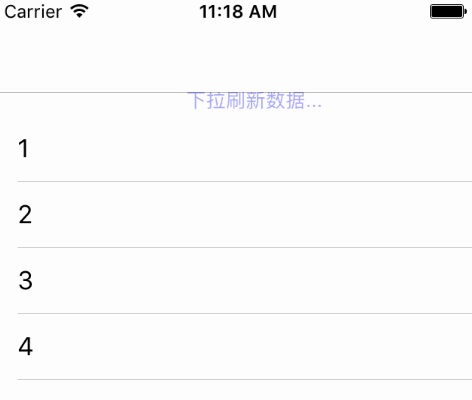

# DxRefreshView


模仿锤子手机的下拉刷新效果.基于swift 3.0编写


Demo:
---



Usage:
---

```Swift
let refreshHeader:DxRefreshView = DxRefreshView();
refreshHeader.color = UIColor.blue;
refreshHeader.actionHandler = {
    //刷新数据
};
tableView.setRefreshHeader(refreshHeader: refreshHeader);
```

数据刷新完成之后,停止刷新动画：

```Swift
scrollView.endRefreshing();
```

不通过下拉触发，直接开始刷新:

```Swift
scrollView.beginRefreshing();
```


[# Objective-C版本](https://github.com/StevenDXC/DxRefreshView_OC)
---
